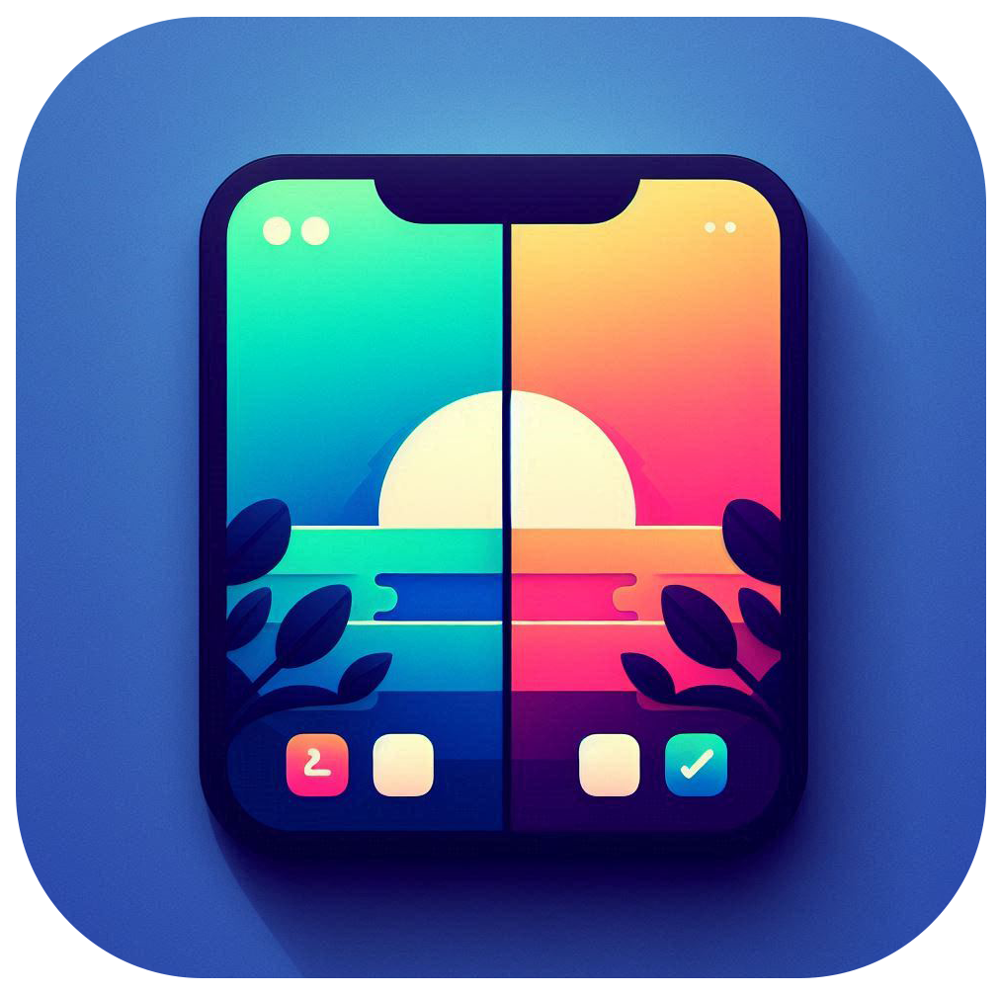

<p align="center">
  
</p>


---


# BlueToothMultiScreenSync

[](https://developer.android.com/) 
[](https://kotlinlang.org/) 
[](#)
[](#)
[](#)


**BlueToothMultiScreenSync** is an experimental Android project that turns multiple smartphones into a **continuous, shared canvas** using **Bluetooth Classic** for communication.  

When you drag an image across the screen of one device, it **seamlessly moves onto the neighboring phone**, with proper scaling, cropping, and alignment.
No matter the devices’ resolutions, pixel densities, or aspect ratios.


The goal is to simulate an **extended display** setup (like dual monitors) without cables or Wi-Fi, using only **Bluetooth pairing**.  


The app is designed for **real-time interaction** (smooth dragging) and a **perfectly aligned visual experience** even if devices are physically different.


---


### Multimedia Assets Consideration

For this demonstration, the images used are pre-loaded and statically present in memory on all devices.

This approach has allowed me to focus entirely on the complex challenges of real-time coordinate synchronization via Bluetooth Classic and adaptive rendering on a virtual canvas, independent of screen specificities.

While extending this to dynamic image streaming or other large media would necessitate exploring higher-bandwidth protocols like Wi-Fi Direct, the goal of this project is to prove the feasibility of a fluid and perfectly aligned multi-screen experience by relying solely on Bluetooth capabilities for interaction management.


---

## Core Objectives

- **Real-time synchronization** of 2D object coordinates between devices over Bluetooth.
- **Consistent visual scaling**: the object’s size stays the same in physical space across all devices.
- **Edge crossing without gaps**: the image continues exactly where it left off.
- **Device-agnostic layout**: works regardless of pixel density (DPI) or resolution.
- **Extendable beyond two devices** (linear chain or grid configurations).


---

## Core Architecture

### 1. **Virtual Canvas System**
- The **Master device** defines the total virtual area (width × height).
- All positions are expressed in **virtual coordinates**, independent of any specific screen resolution.
- Each device is assigned a **viewport** (position and size) within the virtual canvas.

### 2. **Bluetooth Communication**
- **Master → Slaves**: Sends object coordinates and possibly velocity or interaction states.
- **Slaves**: Convert virtual coordinates to local screen coordinates based on their viewport definition.
- Protocol is kept minimal to reduce latency (single position packet per update).

### 3. **Coordinate Mapping**
- **Scaling**: Adjust object size based on master’s definition while keeping proportions identical.
- **Translation**: Position object correctly within the local screen's viewport.
- **Clipping**: If a device’s screen is smaller than the part of the virtual canvas it represents, the extra content is simply not shown.


---

## Features & Technical Approach

### 🔹 Virtual Plane & Viewports
- All devices share the same **virtual plane** measured in **Virtual Units (VU)**.
- The virtual plane acts as the *absolute coordinate system* for all rendering.
- Each device owns a **viewport** within this plane:
  - **offsetX / offsetY** → top-left corner in VU
  - **widthVU / heightVU** → viewport size in VU
- Conversion formula for rendering:
  ```scale = widthPixels / widthVU
  px = (xVU - offsetX) * scale
  py = (yVU - offsetY) * scale
  ```
  - This keeps **scale uniform** across devices while avoiding distortion.

### 🔹 Master / Slave Roles
- **Master device**:
- Defines the virtual plane dimensions.
- Assigns viewports to all devices.
- Tracks object positions in VU.
- Sends updates via Bluetooth.
- **Slave devices**:
- Receive their viewport assignment.
- Map VU → px for local rendering.
- Only draw the visible section of the image.

### 🔹 Drag & Sync
- Touch input can originate from **any device** (Master or Slave).  
- When a Slave detects a drag gesture:
  - It forwards the touch event to the Master.  
  - The Master updates the object position in virtual coordinates.  
  - The Master then **rebroadcasts** the new position to all other Slaves, **excluding the original sender**.  
- When the Master itself detects a drag:
  - It updates the virtual position directly.  
  - It broadcasts the update to all Slaves.  

This ensures a **single source of truth** (the Master), while enabling **full collaborative drag control** of the shared virtual plane across all devices.  


### 🔹 Master-Controlled Virtual Viewports

The Master device fully controls the virtual coordinate system for all Slaves.  
Each Slave receives an **origin offset** `(offsetX, offsetY)` and a **logical orientation** defined by the Master.
This allows the Slave to behave as if its screen were rotated or positioned differently, even if the physical device is locked in portrait mode.  

All object rendering and interaction calculations on the Slave are performed relative to this Master-defined origin.  
- The Master can place Slaves anywhere on the virtual canvas (e.g., one below the Master, one to the right).  
- Slaves map virtual coordinates to their local screen using their assigned viewport.  
- This strategy eliminates the need to handle physical rotation or complex recomposition on Slaves while keeping the shared canvas perfectly aligned across devices.

---

### Reflection & Hidden APIs

This project also includes a **proof-of-concept** that bypasses the mandatory out-of-app Bluetooth pairing flow by using **reflection** to access hidden Android APIs (classified as *light greylist*). 


The purpose is **educational**: to showcase knowledge of low-level Android internals and how developers historically worked around platform restrictions when facing UX-breaking limitations.  

⚠️ **Disclaimer**  
- Hidden APIs are unstable: they can be logged, restricted, or removed without notice in future Android versions. (9->13 : Ok Tiers!)  
- Behavior may differ across OEM implementations and `targetSdkVersion`. (Tested on Samsung and Xiaomi devices + minSdk v28 to v33) 
- Not production-ready — the proper way remains using a `BroadcastReceiver` after standard pairing.  

The reflection hack is kept here as a **portfolio experiment**, demonstrating both awareness of the risks and the ability to design production-safe fallbacks.

---

## Data Flow Overview

1. **Pairing Phase**
 - Devices connect over Bluetooth Classic SPP (RFCOMM).
 - Master is selected; others are Slaves.
2. **Initialization**
 - Master defines:
   - Virtual plane size (VU)
   - Each device’s viewport offsets and size (VU)
 - Sends this data to all Slaves.
3. **Interaction**
 - User drags the image on the Master.
 - Master calculates new position in VU.
 - Broadcasts coordinates to Slaves.
4. **Rendering**
 - Each device converts VU → px.
 - Draws only the visible section.
5. **Seamless Transition**
 - Image moves naturally across physical device borders.

---

## Example Configuration

- **Virtual plane**: `2000 × 1200` VU  
- **Two devices side-by-side**:
- Viewport A: `offsetX=0`, `widthVU=1000`
- Viewport B: `offsetX=1000`, `widthVU=1000`
- **Phone A**: `1080 × 2400 px`, scale = `1080 / 1000 = 1.08`
- **Phone B**: `720 × 1600 px`, scale = `0.72`
- **Image**: `200 × 200` VU at `(900, 100)` VU
- Part visible on A: `108 × 216` px
- Part visible on B: `72 × 144` px
- Alignment is perfect at the shared virtual border (`offsetX=1000`).

---

### Bluetooth Protocol (Optimized)

During prototyping, the communication format was JSON for its readability: 

- **Transport**: Bluetooth Classic SPP (RFCOMM)
- **Message format** (JSON, small & readable):
```json
{
"x": 900.0,
"y": 100.0,
"w": 200.0,
"h": 200.0
}
```
However, for **real-time interaction**, JSON introduces unnecessary overhead (string parsing, field names, UTF-8 encoding).  
The protocol is now moving toward a **binary packet structure** to minimize payload size and latency.  

Example format (16 bytes total):  
```
[ float32 x | float32 y | float32 w | float32 h ]
```
- Fixed-length, no parsing ambiguity.  
- Can be decoded directly into native floats.  
- ~4× smaller than JSON, reducing transmission time and CPU load.  

This shift ensures smoother dragging and better scaling when multiple devices are involved.  

---

### Why Bluetooth Classic Instead of Wi-Fi Direct?

At first glance, **Wi-Fi Direct** seems ideal (higher bandwidth, lower latency).  
But it comes with a critical limitation: once devices are locked into a Wi-Fi Direct group, the **Wi-Fi interface is monopolized**, meaning no concurrent internet access through Wi-Fi.  

That creates friction for scenarios like:  
- Simultaneously downloading the *same asset* on all devices.  
- Syncing shared resources from a server.  
- Keeping online services active while devices collaborate locally.  

To work around this, you’d have to rely solely on **cellular data** for internet access — expensive, unstable, and device-dependent.  

By choosing **Bluetooth Classic**:  
- Local sync happens over Bluetooth.  
- The **Wi-Fi interface remains fully available** for internet.  
- Devices can pull identical resources online while still acting as a shared canvas.  

This trade-off prioritizes **compatibility and flexibility** over raw throughput, while still proving the concept of seamless multi-screen synchronization.  

---

## Bluetooth Connectivity Limitations

While Bluetooth Classic theoretically supports up to `7 simultaneous slave connections per master device` (forming a piconet of 8 total devices), real-world Android implementations present more restrictive constraints.

Practical Limits

- Most Android devices can `reliably maintain 3-4 active SPP` (RFCOMM) connections simultaneously
- This limitation varies significantly between manufacturers and Bluetooth chipsets
Samsung, Xiaomi, OnePlus, and other OEMs may implement different connection limits in their Bluetooth stack


### Hardware Dependencies

- Older Android devices (API < 26) may struggle with multiple concurrent connections
Bluetooth chipset quality directly impacts connection stability and maximum concurrent sockets
Available system resources (RAM, CPU) can affect connection reliability under load


### Recommended Configuration

- 2-3 devices: Optimal performance and stability across most Android devices
- 4+ devices: Possible but requires extensive testing on target hardware

The app automatically detects and adapts to the maximum supported connections per device.


### Fallback Strategy

If connection limits are reached, the master device will prioritize the most recently paired slaves and gracefully handle disconnections by redistributing viewports among remaining active devices.

---

## ⚠️ Technical Considerations

 - Latency: Bluetooth Classic has ~20–50 ms typical latency → good for dragging, bad for ultra-fast animation.

 - Bezels: Large physical bezels break the visual illusion unless compensated.

 - Uniform scale: must be applied equally to X and Y to prevent distortion.

 - Partial rendering: crop logic must handle cases where the image is 100% outside the viewport.


## Future Extensions

### Multi-Device Grid
Support more than two devices, e.g., 2×2 grid configuration. Each device would:
- Know its grid position (row, column).
- Calculate its viewport based on grid cell.
- Map incoming virtual coordinates accordingly.

### Dynamic Device Joining
Allow devices to join or leave the virtual canvas dynamically. Upon joining:
- The master sends updated virtual layout and assigns the new device’s viewport.

### Alternative Communication Protocols
While Bluetooth ensures offline use, future versions may support:
- **Wi-Fi Direct** for higher bandwidth and lower latency.
- **WebSocket over LAN** for mixed-platform setups.

### Extended Interaction
Enable:
- Multiple draggable objects.
- Cross-device gestures.
- Shared state beyond just position (e.g., rotation, scale).

### Reflection Cleanup
In a production-ready version, all reflection code will be removed in favor of stable public APIs only.  
   
---

